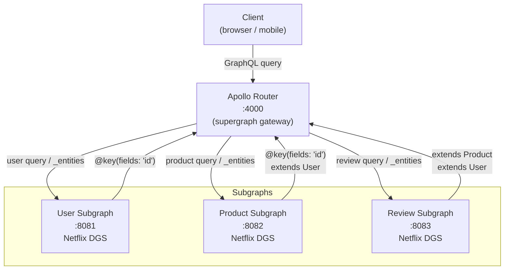

# GraphQL Federation Playground

[](LICENSE)
[](https://openjdk.org/)
[](https://spring.io/projects/spring-boot)
[](https://netflix.github.io/dgs/)

A working example of **Apollo Federation** with multiple Java subgraphs, composed by **Apollo Router** into a single unified API. Each subgraph is a standalone Spring Boot service built with the **Netflix DGS Framework**.

This isn't a toy — it covers the patterns you actually hit in production: entity resolution across subgraph boundaries, DataLoaders for N+1 prevention, subscriptions for real-time updates, and custom directives for auth and caching.

## Architecture



A single federated query like this:

```graphql
query {
  product(id: "p1") {
    name
    price
    createdBy {       # resolved by User subgraph
      username
    }
    reviews {         # resolved by Review subgraph
      rating
      comment
      author {        # resolved by User subgraph
        username
      }
    }
  }
}
```

...is transparently split by Apollo Router into sub-queries to each relevant subgraph, joined by entity references, and returned as a single response.

## Subgraphs

| Service | Port | Owns | Federation Role |
|---------|------|------|-----------------|
| `user-subgraph` | 8081 | `User` type | Entity origin — other subgraphs reference `User @key(fields: "id")` |
| `product-subgraph` | 8082 | `Product` type | Entity origin — extends `User` with `products` field |
| `review-subgraph` | 8083 | `Review` type | Extends `Product` with `reviews` field, extends `User` with `reviews` field |
| `Apollo Router` | 4000 | Supergraph | Composes all subgraphs into one unified schema |

## Tech Stack

- Java 17 + Spring Boot 3.2
- [Netflix DGS Framework](https://netflix.github.io/dgs/) 8.x — GraphQL server with Apollo Federation support
- [Apollo Router](https://www.apollographql.com/docs/router/) — Rust-based high-performance federation gateway
- [Apollo Rover CLI](https://www.apollographql.com/docs/rover/) — Schema composition and publishing
- DataLoader pattern for N+1 prevention
- GraphQL Subscriptions over WebSocket

## Quick Start

### Prerequisites

- Java 17+, Maven 3.8+
- Docker + Docker Compose
- [Rover CLI](https://www.apollographql.com/docs/rover/getting-started/) (for schema composition)

### Run with Docker Compose

```bash
# Build and start everything (subgraphs compile inside Docker — no local Maven needed)
docker compose up -d --build

# Tail logs for all services
docker compose logs -f

# The unified GraphQL API + Apollo Sandbox UI:
# http://localhost:4000

# Jaeger distributed tracing UI:
# http://localhost:16686
```

Apollo Router waits for all three subgraphs to pass their health checks before accepting traffic.

### Run subgraphs individually

```bash
# User subgraph
cd user-subgraph && mvn spring-boot:run
# → http://localhost:8081/graphql

# Product subgraph
cd product-subgraph && mvn spring-boot:run
# → http://localhost:8082/graphql

# Review subgraph
cd review-subgraph && mvn spring-boot:run
# → http://localhost:8083/graphql
```

### Compose the supergraph schema

```bash
rover supergraph compose --config gateway/supergraph.yaml > gateway/supergraph.graphql
```

## Sample Queries

```graphql
# Get user with their products and reviews
query UserWithContent {
  user(id: "u1") {
    name
    email
    products {
      name
      price
    }
  }
}

# Paginated product catalog with filters
query ProductCatalog {
  products(filter: { category: "electronics" }, page: 0, size: 10) {
    nodes {
      id
      name
      price
      reviews {
        rating
        comment
      }
    }
    totalCount
    hasNextPage
  }
}

# Create a review
mutation AddReview {
  createReview(input: {
    productId: "p1"
    rating: 5
    comment: "Excellent build quality"
  }) {
    id
    rating
    product {
      name
    }
  }
}
```

## Project Structure

```
graphql-federation-playground/
├── user-subgraph/          # User type, profiles, entity fetcher
│   └── Dockerfile
├── product-subgraph/       # Product catalog, pagination, filtering
│   └── Dockerfile
├── review-subgraph/        # Reviews, DataLoader, subscriptions
│   └── Dockerfile
├── gateway/
│   ├── Dockerfile          # Apollo Router image
│   ├── supergraph.yaml     # Rover composition config
│   ├── supergraph.graphql  # Composed supergraph schema (generated)
│   └── router.yaml         # Apollo Router config (JWT auth + query limits)
├── docker-compose.yml      # Boots the full stack with one command
└── README.md
```

## Roadmap

- [x] Project structure and build setup
- [x] User subgraph (schema + resolvers + entity fetcher)
- [x] Product subgraph (catalog + pagination + filtering)
- [x] Review subgraph (extends Product + DataLoader)
- [x] Apollo Router gateway (composition + JWT auth + query limits)
- [x] Docker Compose for full federation stack
- [ ] Integration tests across subgraph boundaries
- [ ] GraphQL Subscriptions (real-time reviews)
- [ ] Custom directives (`@auth`, `@cacheControl`)
- [ ] Query tracing and performance analysis

## License

[Apache License 2.0](LICENSE)
